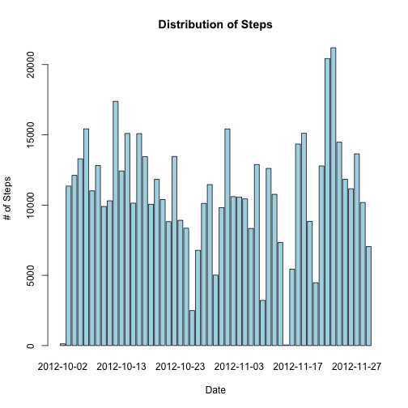
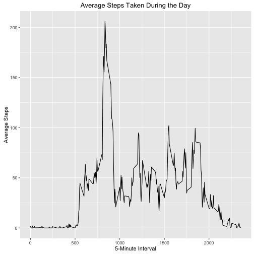
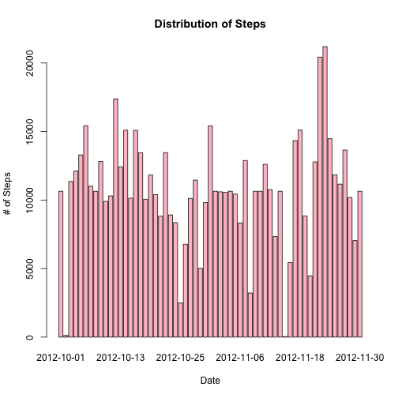
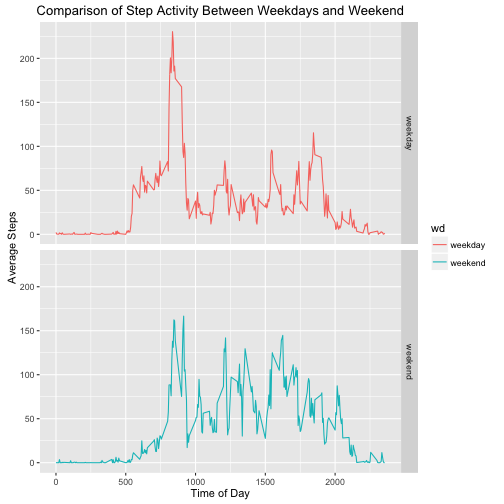

### Question 1 - Loading and preprocessing the data
*Show any code that is needed to: Load the data (i.e. read.csv()), and process/transform the data (if necessary) into a format suitable for your analysis.*

First, read in the file using `read.csv()`. I cache this and the following block, so they don't have to repeatedly load in the data.

```r
setwd("~/Documents/Courses/Coursera/5 - Reproducible Research/RepData_PeerAssessment1")
dSteps <- read.csv("activity.csv")
```

```
## Warning in file(file, "rt"): cannot open file 'activity.csv': No such file
## or directory
```

```
## Error in file(file, "rt"): cannot open the connection
```

```r
str(dSteps)
```

```
## 'data.frame':	17568 obs. of  3 variables:
##  $ steps   : int  NA NA NA NA NA NA NA NA NA NA ...
##  $ date    : Date, format: "2012-10-01" "2012-10-01" ...
##  $ interval: int  0 5 10 15 20 25 30 35 40 45 ...
```
Next, transform the _date_ field from factors to actual dates. 

```r
dSteps$date <- as.Date(dSteps$date, format="%Y-%m-%d")
str(dSteps)
```

```
## 'data.frame':	17568 obs. of  3 variables:
##  $ steps   : int  NA NA NA NA NA NA NA NA NA NA ...
##  $ date    : Date, format: "2012-10-01" "2012-10-01" ...
##  $ interval: int  0 5 10 15 20 25 30 35 40 45 ...
```

### Question 2 - What is mean total number of steps taken per day?
*For this part of the assignment, you can ignore the missing values in the dataset. Make a histogram of the total number of steps taken each day. Calculate and report the mean and median total number of steps taken per day.*

First, remove the NAs from the _steps_ column. I use the `dplyr` package to do this.

```r
library(dplyr)
dSteps.f <- filter(dSteps, !is.na(steps))
```

Then, create the histogram. I assume that the histogram is actually by date and showing the number of steps, which makes it a barplot in the terminology of the base plotting package. Again, I use the *dplyr* package's `filter` and `summarize` functions. 

```r
dSteps.date <- group_by(dSteps.f, date)
dSteps.day <- summarize(dSteps.date, steps = sum(steps, na.rm=TRUE))
barplot(dSteps.day$steps, names.arg=dSteps.day$date, main="Distribution of Steps",
        xlab="Date", ylab="# of Steps", col="light blue")
```



For the second part of the question, I merely calculate and print out the mean and median.

```r
mean(dSteps.day$steps)
```

```
## [1] 10766.19
```

```r
median(dSteps.day$steps)
```

```
## [1] 10765
```

### Question 3: What is the average daily activity pattern?
*Make a time series plot (i.e. type = "l") of the 5-minute interval (x-axis) and the average number of steps taken, averaged across all days (y-axis). Which 5-minute interval, on average across all the days in the dataset, contains the maximum number of steps?*

Next, using the *dplyr* functions, we organize the steps by time interval. As a sanity check, I noted that, with the 5-minute interval, there should be 24*12 = 288 rows of data.

```r
dSteps.interval <- group_by(dSteps.f, interval)
dSteps.mean <- summarize(dSteps.interval, steps = mean(steps, na.rm=TRUE))
library(ggplot2)
qplot(interval, steps, data=dSteps.mean, geom="line", main="Average Steps Taken During the Day", xlab = "5-Minute Interval", ylab = "Average Steps")
```



We use the `arrange()` function from the *dplyr* package to sort the means, highest to lowest to determine the max.

```r
dSteps.sort <- arrange(dSteps.mean, desc(steps))
dSteps.sort[1,]
```

```
## Source: local data frame [1 x 2]
## 
##   interval    steps
##      (int)    (dbl)
## 1      835 206.1698
```

So, on average, the subject took the most steps, 206.1698113 at interval #835. 

### Question 4: Imputing missing values
*Note that there are a number of days/intervals where there are missing values (coded as NA). The presence of missing days may introduce bias into some calculations or summaries of the data.*

#### 1. Calculate and report the total number of missing values in the dataset (i.e. the total number of rows with NAs)

This can be simply done by subtracting the number of rows in the filtered dataset from the original data set.


```r
nrow(dSteps) - nrow(dSteps.f)
```

```
## [1] 2304
```

The total number of missing rows is 2304.

#### 2. Devise a strategy for filling in all of the missing values in the dataset. The strategy does not need to be sophisticated. For example, you could use the mean/median for that day, or the mean for that 5-minute interval, etc.

My strategy for filling in the data set will be to use the average number of steps for that particular interval, rounded to the nearest integer.

```r
dSteps.complete <- dSteps  # initialize the complete dataset with the original
str(dSteps.complete)
```

```
## 'data.frame':	17568 obs. of  3 variables:
##  $ steps   : int  NA NA NA NA NA NA NA NA NA NA ...
##  $ date    : Date, format: "2012-10-01" "2012-10-01" ...
##  $ interval: int  0 5 10 15 20 25 30 35 40 45 ...
```

#### 3. Create a new dataset that is equal to the original dataset but with the missing data filled in.

For any row with "NA" for steps, use the mean steps for that interval. The printout below shows that the NAs are now replaced by integer values.


```r
dSteps.NAs <- is.na(dSteps$steps)
dSteps.complete[dSteps.NAs,]$steps <- 
    as.integer(dSteps.mean[dSteps.mean$interval == dSteps[dSteps.NAs,]$interval]$steps)
str(dSteps.complete)
```

```
## 'data.frame':	17568 obs. of  3 variables:
##  $ steps   : int  1 0 0 0 0 2 0 0 0 1 ...
##  $ date    : Date, format: "2012-10-01" "2012-10-01" ...
##  $ interval: int  0 5 10 15 20 25 30 35 40 45 ...
```

#### 4. Make a histogram of the total number of steps taken each day and Calculate and report the mean and median total number of steps taken per day. Do these values differ from the estimates from the first part of the assignment? What is the impact of imputing missing data on the estimates of the total daily number of steps?


```r
dSteps.comp.date <- group_by(dSteps.complete, date)
dSteps.comp.day <- summarize(dSteps.comp.date, steps = sum(steps, na.rm=TRUE))
barplot(dSteps.comp.day$steps, names.arg=dSteps.comp.day$date, 
        main="Distribution of Steps",
        xlab="Date", ylab="# of Steps", col="pink")
```



Here are the mean and median. They are slightly different.

```r
mean(dSteps.comp.day$steps)
```

```
## [1] 10749.77
```

```r
median(dSteps.comp.day$steps)
```

```
## [1] 10641
```

Couldn't get `xtable()` to work, so just making a data.frame table.


```r
tbl <- data.frame(Original=1:2, NAs.Replaced=1:2)
row.names(tbl) <- c("Mean", "Median")
tbl$Original[1] <- mean(dSteps.day$steps)
tbl$Original[2] <- median(dSteps.day$steps)
tbl$NAs.Replaced[1] <- mean(dSteps.comp.day$steps)
tbl$NAs.Replaced[2] <- median(dSteps.comp.day$steps)
tbl
```

```
##        Original NAs.Replaced
## Mean   10766.19     10749.77
## Median 10765.00     10641.00
```

So, we can see that the data with the imputed missing data (NAs replaced) has slightly lower means and medians than when we removed the NAs from the original data.

### Question 5: Are there differences in activity patterns between weekdays and weekends?
*For this part the weekdays() function may be of some help here. Use the dataset with the filled-in missing values for this part.*

#### Create a new factor variable in the dataset with two levels -- "weekday" and "weekend" indicating whether a given date is a weekday or weekend day.

Using the `mutate()` function to do this.

```r
dSteps.w <- mutate(dSteps.complete, wd = ifelse(weekdays(dSteps.complete$date) %in% c("Sunday", "Saturday"), "weekend", "weekday"))
head(dSteps.w)
```

```
##   steps       date interval      wd
## 1     1 2012-10-01        0 weekday
## 2     0 2012-10-01        5 weekday
## 3     0 2012-10-01       10 weekday
## 4     0 2012-10-01       15 weekday
## 5     0 2012-10-01       20 weekday
## 6     2 2012-10-01       25 weekday
```

#### Make a panel plot containing a time series plot (i.e. type = "l") of the 5-minute interval (x-axis) and the average number of steps taken, averaged across all weekday days or weekend days (y-axis).


```r
dw <- group_by(dSteps.w, wd, interval)
dw.mean <- summarize(dw, mean.steps = mean(steps))
g <- qplot(interval, mean.steps, data = dw.mean, facets = wd ~ ., geom = "line", color = wd)
g + labs(title = "Comparison of Step Activity Between Weekdays and Weekend") +
    labs(x = "Time of Day", y = "Average Steps")
```



